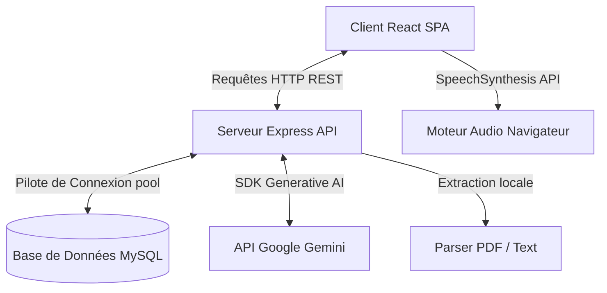
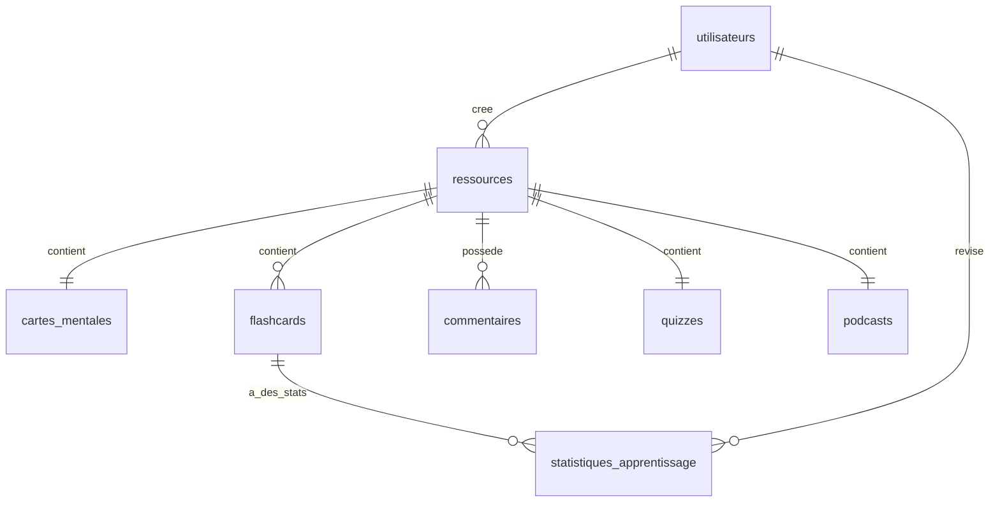

# Rapport de Projet Complet : EduPath (Plateforme d'Apprentissage Augmentée par l'IA)

Ce document décrit en détail l'architecture, la modélisation des données, les fonctionnalités intelligentes et le design system de la plateforme **EduPath**. Inspirée du concept d'espace de travail interactif de Google NotebookLM, la plateforme permet le traitement automatique de cours (documents PDF ou vidéos YouTube) et en extrait une synthèse textuelle, des cartes mentales interactives en SVG, des flashcards basées sur la taxonomie de Bloom avec répétition espacée, un chatbot contextuel guidé par le document, un quiz interactif d'évaluation et un studio de discussion de podcast lu par synthèse vocale.

---

## Table des Matières
1. [Aperçu Global et Objectifs](#1-aperçu-global-et-objectifs)
2. [Architecture Technique & Stack](#2-architecture-technique--stack)
3. [Base de Données et Schéma MySQL](#3-base-de-données-et-schéma-mysql)
4. [Documentation des APIs (Endpoints REST)](#4-documentation-des-apis-endpoints-rest)
5. [Intégration de l'IA (Google Gemini)](#5-intégration-de-lia-google-gemini)
6. [Espace de Travail & Fonctionnalités Clés](#6-espace-de-travail--fonctionnalités-clés)
7. [Design System & Gestion des Modes (Clair / Sombre)](#7-design-system--gestion-des-modes-clair--sombre)
8. [Guide d'Installation et de Démarrage](#8-guide-dinstallation-et-de-démarrage)

---

## 1. Aperçu Global et Objectifs

**EduPath** a été conçue pour réinventer l'apprentissage en ligne en transformant les contenus académiques passifs en outils d'étude interactifs et personnalisés :
* **Apprentissage Actif** : Remplacer la simple lecture ou visionnage par des cartes mentales cliquables, des flashcards à mémorisation espacée et des quiz immédiats.
* **Tuteur IA de Confiance (NotebookLM-like)** : Offrir un chatbot dont les réponses s'appuient strictement sur le texte du cours pour éviter les hallucinations classiques des modèles de langage.
* **Multimodalité** : Gérer les documents PDF (avec extraction textuelle locale) et les cours vidéos (par transcription et extraction thématique).
* **Synthèse Audio Unique (Studio Podcast)** : Générer un podcast sous forme de dialogue entre deux présentateurs fictifs (Sophie et Marc) pour permettre aux étudiants d'écouter une discussion animée sur le cours en mobilisant leur mémoire auditive.

---

## 2. Architecture Technique & Stack

Le projet adopte une architecture découplée classique avec un serveur API en Node.js et un client Single Page Application (SPA) en React :



### Stack Technique
* **Frontend** :
  * **React v18** + **Vite** : Pour des temps de build ultra-rapides et un rechargement HMR instantané.
  * **CSS Vanilla** : Un système de design moderne codé en CSS pur avec des variables personnalisées adaptatives pour le mode clair et sombre, sans dépendance externe lourde (pas de Tailwind).
  * **SVG D3-inspired & Native DOM** : Pour un rendu léger et interactif de la carte mentale.
  * **SpeechSynthesis Web Speech API** : Utilisée côté client pour faire parler les avatars de Sophie et Marc sans surcoût réseau ni clés d'API tierces.
* **Backend** :
  * **Node.js** + **Express** : Serveur REST assurant la distribution des données, l'accès sécurisé et les téléversements.
  * **Multer** : Middleware pour gérer l'upload physique des fichiers PDF.
  * **PDF-Extractor** : Extraction de texte brute locale intégrée pour lire les PDF sur le serveur.
  * **Crypto** : Module de sécurité Node.js utilisé pour le calcul de signatures MD5 uniques de fichiers (caching) et le hachage sécurisé des mots de passe.
* **Base de Données** :
  * **MySQL** : Persistance robuste de toutes les ressources, comptes utilisateurs, quiz, flashcards, statistiques d'apprentissage espacé et commentaires.

---

## 3. Base de Données et Schéma MySQL

La base de données MySQL est automatiquement créée et migrée au lancement du backend via le module [db.js](file:///c:/Users/Anas/.gemini/antigravity-ide/scratch/edupath/backend/db.js). Elle est composée de 9 tables clés :



### Structure détaillée des tables :

#### 1. Table `utilisateurs`
Stocke les profils des utilisateurs (Étudiants, Enseignants, Administrateurs).
* `id` (VARCHAR(100), PK) : Identifiant unique.
* `nom` (VARCHAR(255)) : Nom complet de l'utilisateur.
* `email` (VARCHAR(255), UNIQUE) : Adresse email d'inscription.
* `role` (VARCHAR(50)) : Rôle système (`etudiant`, `enseignant`, `admin`).
* `motDePasse` (VARCHAR(255)) : Mot de passe chiffré par un algorithme de hachage SHA-256 avec sel fixe.
* `specialite` (VARCHAR(255), optionnel) : Domaine d'études de l'étudiant ou d'enseignement.
* `niveauEtude` (VARCHAR(255), optionnel) : Niveau académique (ex. Licence 3, Master).
* `dateCreation` (VARCHAR(100)) : Date de création du profil.
* `dateModification` (VARCHAR(100)) : Date de dernière modification.

#### 2. Table `ressources`
Modélise les cours téléversés ou enregistrés.
* `id` (VARCHAR(100), PK) : Identifiant unique de la ressource.
* `titre` (VARCHAR(255)) : Titre du cours.
* `type` (VARCHAR(50)) : Type de support (`pdf` ou `video`).
* `hashFichier` (VARCHAR(255)) : Somme de contrôle MD5 unique calculée sur le fichier physique (utilisée pour l'IA Cache Pipeline).
* `cheminFichier` (VARCHAR(255)) : URL de la vidéo YouTube ou chemin d'accès local du PDF.
* `creePar` (VARCHAR(100), FK) : Référence de l'utilisateur créateur.
* `estValide` (TINYINT) : Statut de validation par l'enseignant (`1` = validé et publié aux étudiants, `0` = en attente de révision).
* `contenuTexte` (LONGTEXT, optionnel) : Texte brut extrait du PDF ou transcription textuelle.
* `resume` (LONGTEXT, optionnel) : Synthèse textuelle générée par l'IA au format Markdown.
* `dateCreation` (VARCHAR(100))
* `dateModification` (VARCHAR(100))

#### 3. Table `cartes_mentales`
Stocke la structure nodale de la carte mentale sous forme de structures JSON indexées.
* `id` (VARCHAR(100), PK)
* `ressourceId` (VARCHAR(100), FK) : Ressource parente.
* `noeudsJSON` (LONGTEXT) : Chaîne JSON contenant la liste des nœuds (identifiant, label, type, description).
* `liensJSON` (LONGTEXT) : Chaîne JSON contenant les vecteurs de liaison source-destination.
* `dateCreation` (VARCHAR(100))
* `dateModification` (VARCHAR(100))

#### 4. Table `flashcards`
Contient les cartes d'apprentissage cognitif.
* `id` (VARCHAR(100), PK)
* `ressourceId` (VARCHAR(100), FK)
* `question` (TEXT) : Question formulée.
* `reponse` (TEXT) : Réponse attendue.
* `niveauBloom` (VARCHAR(100)) : Taxonomie (Mémorisation, Compréhension, Application, Analyse, Évaluation, Création).
* `dateCreation` (VARCHAR(100))
* `dateModification` (VARCHAR(100))

#### 5. Table `quizzes`
Stocke la série de questions de quiz QCM générées par l'IA.
* `id` (VARCHAR(100), PK)
* `ressourceId` (VARCHAR(100), FK)
* `questionsJSON` (LONGTEXT) : Tableau JSON contenant les 5 questions, options de réponse, index de bonne option et explications détaillées.
* `dateCreation` (VARCHAR(100))

#### 6. Table `podcasts`
Contient le script conversationnel du podcast d'étude.
* `id` (VARCHAR(100), PK)
* `ressourceId` (VARCHAR(100), FK)
* `dialogueJSON` (LONGTEXT) : Tableau JSON de répliques alternées de Sophie et Marc (`speaker`, `text`).
* `dateCreation` (VARCHAR(100))

#### 7. Table `statistiques_apprentissage`
Suivi individuel SM-2 pour l'apprentissage à répétition espacée.
* `id` (VARCHAR(100), PK)
* `etudiantId` (VARCHAR(100), FK)
* `flashcardId` (VARCHAR(100), FK)
* `repetitions` (INT) : Nombre de révisions réussies consécutives.
* `intervalle` (INT) : Nombre de jours avant la prochaine révision suggérée.
* `scoreFacilite` (DOUBLE) : Facteur de facilité (E-factor, par défaut 2.5).
* `dateProchaineRevision` (VARCHAR(100)) : Prochaine date d'échéance.
* `dateCreation` (VARCHAR(100))
* `dateModification` (VARCHAR(100))

#### 8. Table `commentaires`
Fils de discussion collaboratifs par cours.
* `id` (VARCHAR(100), PK)
* `ressourceId` (VARCHAR(100), FK)
* `auteurId` (VARCHAR(100))
* `auteurNom` (VARCHAR(255))
* `auteurRole` (VARCHAR(50))
* `contenu` (TEXT)
* `dateCreation` (VARCHAR(100))

#### 9. Table `jobs`
File d'attente du statut de traitement asynchrone des médias par l'IA.
* `id` (VARCHAR(100), PK)
* `ressourceId` (VARCHAR(100), FK)
* `statut` (VARCHAR(50)) : `pending`, `completed`, ou `failed`.
* `erreurMessage` (TEXT)

---

## 4. Documentation des APIs (Endpoints REST)

Le serveur Node.js expose des points d'accès structurés pour communiquer avec le client React.

### Authentification & Utilisateurs
* `GET /api/users` : Récupère les profils (sans exposer le mot de passe hashé).
* `POST /api/users` : Inscription d'un nouvel utilisateur (hache le mot de passe en SHA-256 avant stockage et vérifie l'unicité de l'email).
* `POST /api/users/login` : Connecte l'utilisateur en validant l'email et le mot de passe chiffré.

### Gestion des Ressources
* `GET /api/resources?role=:role` : Liste les ressources. Si `role=etudiant`, seules les ressources validées (`estValide=1`) sont retournées.
* `GET /api/resources/:id` : Récupère les informations complètes d'un cours.
* `POST /api/resources/upload` : Téléverse un fichier (PDF) ou crée une fiche vidéo.
  * **IA Cache Pipeline** : Calcule le hash MD5 du fichier. S'il correspond à un cours déjà traité par le passé, le serveur copie instantanément les flashcards, cartes mentales et quiz générés de l'ancien cours vers le nouveau, évitant ainsi des appels répétés coûteux à l'API Gemini.
  * **Traitement Asynchrone** : Si le hash est inconnu, un Job `pending` est inséré et le traitement d'extraction et de génération par l'IA démarre en tâche de fond.
* `PUT /api/resources/:id/validate` : Modifie le statut de publication d'une ressource (action enseignant).
* `DELETE /api/resources/:id` : Supprime une ressource ainsi que ses flashcards, sa carte mentale, son quiz et son podcast associés.

### Matériels Pédagogiques Générés par l'IA
* `GET /api/resources/:id/mindmap` : Récupère la structure de la carte mentale.
* `GET /api/resources/:id/flashcards` : Liste les flashcards d'apprentissage associées au cours.
* `GET /api/resources/:id/quiz` : Récupère le quiz QCM de 5 questions (génère automatiquement un quiz via Gemini si la table MySQL renvoie un résultat vide).
* `GET /api/resources/:id/podcast` : Récupère le script du podcast éducatif de Sophie et Marc (génère via Gemini en cas d'absence).
* `POST /api/resources/:id/chat` : Envoie une question à l'assistant. Le serveur interroge Gemini en lui passant le texte du cours dans les consignes système (`systemInstruction`) pour un guidage contextualisé.

### Répétition Espacée & Commentaires
* `POST /api/flashcards/:id/review` : Enregistre le feedback d'évaluation d'une flashcard (boutons "Je sais" ou "À revoir") et applique l'algorithme SuperMemo-2 (SM-2) pour mettre à jour l'intervalle et la date de prochaine révision.
* `GET /api/resources/:id/comments` : Récupère le fil de discussion de la ressource.
* `POST /api/resources/:id/comments` : Publie un commentaire.

---

## 5. Intégration de l'IA (Google Gemini)

### Configuration et Modèles
L'application utilise le SDK officiel `@google/generative-ai`.
* **Modèle Principal** : `gemini-2.5-flash` est utilisé pour sa vitesse de traitement élevée, son coût maîtrisé, son excellent respect des contraintes JSON structurelles, et sa fenêtre de contexte capable de traiter des documents entiers.
* **Clé API** : Transmise de manière sécurisée par la variable d'environnement `GEMINI_API_KEY`.
* **Simulateur Pédagogique Intelligent (Offline/Fallback Mode)** : Si la clé API est manquante ou si le serveur de Google est injoignable, le backend bascule vers un module d'intelligence artificielle locale simulée qui :
  * Génère un résumé en découpant le document source.
  * Génère des flashcards thématiques et une structure de carte mentale en analysant les mots récurrents les plus fréquents.
  * Effectue une recherche sémantique simplifiée pour le chatbot (QA par filtrage et score des phrases du cours).

### Conception des Prompts (Prompts Engineering)
Le backend injecte des directives rigoureuses pour contraindre les retours de Gemini au format JSON. Par exemple, pour les matériels d'apprentissage :
```json
{
  "summary": "Synthèse au format Markdown d'au moins 4 paragraphes...",
  "mindmap": {
    "nodes": [ { "id": "...", "label": "...", "type": "root|main|sub|concept", "description": "..." } ],
    "links": [ { "source": "...", "target": "..." } ]
  },
  "flashcards": [ { "question": "...", "reponse": "...", "niveauBloom": "..." } ],
  "quiz": [ { "question": "...", "options": ["...", "...", "...", "..."], "correctOptionIndex": 0, "explanation": "..." } ]
}
```
Pour le dialogue de podcast, le prompt demande à l'IA d'adopter deux rôles distincts (Sophie et Marc) et de débattre des notions du cours de façon vivante en fournissant un tableau structuré : `[{ "speaker": "Sophie|Marc", "text": "..." }]`.

---

## 6. Espace de Travail & Fonctionnalités Clés

### A. Espace de Travail Scindé (NotebookLM Workspace)
Lorsqu'un étudiant consulte une ressource, l'écran est divisé verticalement en deux parties équilibrées (50% / 50%) :
* **Zone Gauche (Source)** : Affiche la liseuse de document PDF interactive pour une lecture directe du cours, ou un lecteur vidéo YouTube adapté si le cours est une ressource vidéo.
* **Zone Droite (Onglets IA)** : Permet à l'étudiant d'interagir avec les outils générés par l'IA sans perdre de vue le contenu source.

### B. Carte Mentale SVG Interactive
Le composant `MindMapViewer` dessine dynamiquement les nœuds d'apprentissage de façon fluide :
* **Arrière-plan Technique** : Fond moderne avec une grille de pointillés sombres ou clairs, créant une ambiance de tableau blanc professionnel.
* **Icônes thématiques** : Chaque type de nœud affiche un indicateur visuel (🎯 pour le concept racine, 📖 pour les chapitres principaux, 💡 pour les notions détaillées).
* **Interactivité** : Cliquer sur un nœud affiche ses informations détaillées et sa description explicative dans un tiroir latéral d'information.

### C. Quiz Interactif
Permet une auto-évaluation instantanée :
* **Mode Étape par Étape** : L'étudiant répond aux questions une par une.
* **Validation Visuelle** : Les options sélectionnées s'allument en vert (correct) ou rouge (incorrect) avec l'affichage immédiat de l'explication théorique rédigée par l'IA.
* **Tableau des Scores** : Bilan final avec pourcentage de réussite pour encourager la progression.

### D. Studio Podcast IA
Une fonctionnalité unique d'apprentissage auditif :
* **Synthèse Vocale Native** : Utilise `window.speechSynthesis`.
* **Alternance des Voix** :
  * **Sophie** : Configurée avec une voix féminine douce et un débit posé.
  * **Marc** : Paramétré avec une voix masculine plus grave et un débit plus énergique pour simuler une émission de radio animée.
* **Synchronisation Visuelle** : La réplique en cours de lecture vocale s'affiche en surbrillance avec un indicateur lumineux d'onde audio actif à côté du présentateur qui parle.

---

## 7. Design System & Gestion des Modes (Clair / Sombre)

EduPath intègre une interface utilisateur de qualité supérieure (Premium Glassmorphic Design) reposant entièrement sur des CSS variables.

### Palette de Couleurs Homogène
* **Mode Sombre (Par défaut)** : Ambiance immersive bleu nuit / violet spatial.
  * `--bg-main` : `#0f172a` (slate-900)
  * `--bg-panel` : `rgba(30, 41, 59, 0.7)` (slate-800 avec transparence)
  * `--border-glass` : `rgba(255, 255, 255, 0.08)`
  * `--primary` : `#8b5cf6` (violet)
  * `--secondary` : `#06b6d4` (cyan)
* **Mode Clair** : Luminosité, propreté et contrastes de haute qualité.
  * `--bg-main` : `#f8fafc` (slate-50)
  * `--bg-panel` : `rgba(255, 255, 255, 0.8)` (blanc verre acrylique)
  * `--border-glass` : `rgba(0, 0, 0, 0.08)`
  * **Texte Noir Pur (Accessibilité)** : Pour répondre aux critères stricts de lisibilité sous forte luminosité, toutes les écritures s'affichent en noir absolu (`#000000` ou `#111111`) en mode clair :
    ```css
    [data-theme='light'] {
      --text-primary: #000000;
      --text-secondary: #111111;
      --text-muted: #222222;
      --bg-input: #ffffff;
      --border-glass: rgba(0, 0, 0, 0.15);
    }
    ```

---

## 8. Guide d'Installation et de Démarrage

### Prérequis
* Node.js (v18+)
* MySQL Server fonctionnel

### Étape 1 : Configuration des Variables d'Environnement
Créez un fichier `.env` dans le dossier `backend/` avec les valeurs suivantes :
```env
PORT=5000
DB_HOST=localhost
DB_USER=votre_utilisateur
DB_PASSWORD=votre_mot_de_passe
DB_NAME=edupath
GEMINI_API_KEY=votre_cle_gemini_api
```

### Étape 2 : Installation des Dépendances
Dans le dossier racine, exécutez les installations :
```bash
# Dans le dossier backend
cd backend
npm install

# Dans le dossier frontend
cd ../frontend
npm install
```

### Étape 3 : Démarrage en Mode Développement
Vous pouvez lancer les serveurs simultanément :
* **Démarrer le Backend** : `npm run dev` (démarre Nodemon sur le port `5000`).
* **Démarrer le Frontend** : `npm run dev` (démarre Vite sur le port `5174` ou `5173`).

### Profils de Test Préconfigurés (Authentification Sécurisée)
Pour faciliter les tests d'évaluation, les comptes suivants sont créés automatiquement avec des mots de passe sécurisés par défaut :
1. **Étudiant** :
   * Email : `lucas.bernard@etu.edupath.fr`
   * Mot de passe : `lucas123`
2. **Enseignant** :
   * Email : `jean.martin@prof.edupath.fr`
   * Mot de passe : `jean123`
3. **Administrateur** :
   * Email : `admin@edupath.fr`
   * Mot de passe : `admin123`
